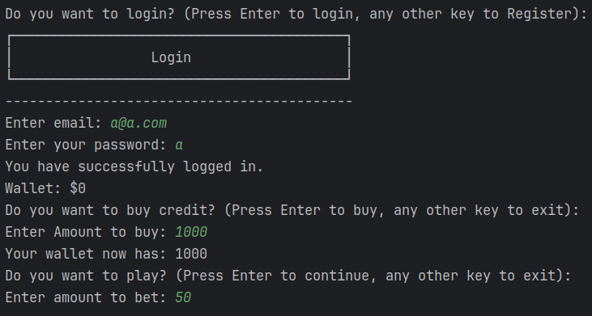
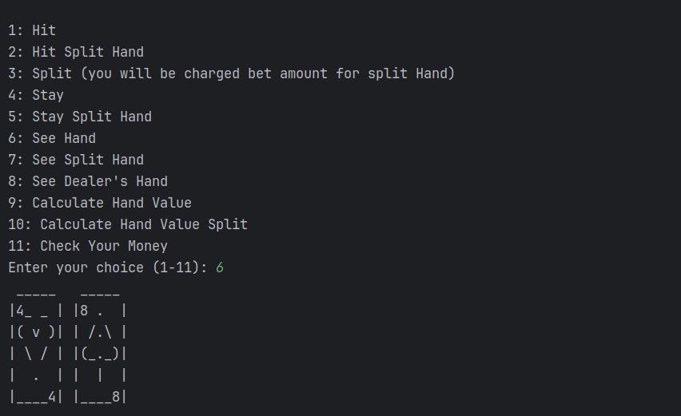
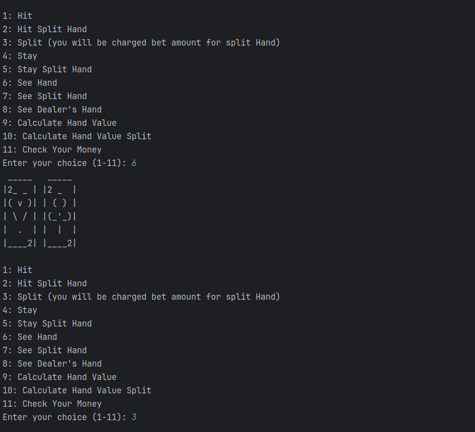
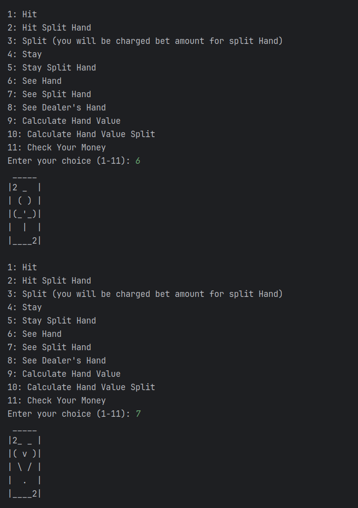
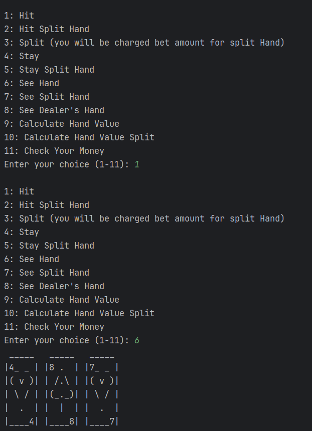
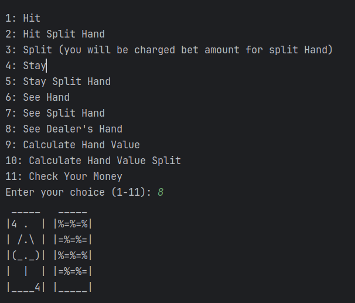
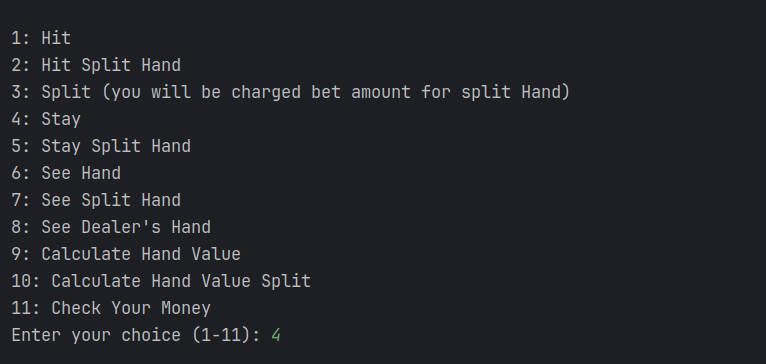
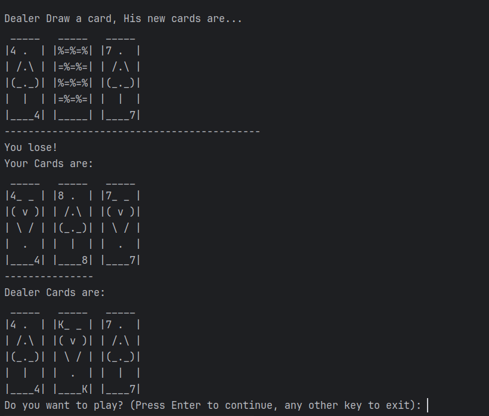

# Blackjack Game

This project is a console-based Blackjack game implemented in Java,
using Spring Boot for the backend structure,
including Spring JPA for database interactions and Spring Security for authentication.
Currently, the game operates solely through the console as the frontend has not been developed yet.
It features a detailed simulation of the Blackjack card game,
including betting, card handling, and game logic,
with a focus on object-oriented design and Spring Framework best practices.

## Installation
To run this project, you'll need Java JDK 8 (also known as JDK 1.8) or later and Maven for dependency management.

1. Clone the repository
2. Navigate to the project directory
3. Build the project using Maven
4. Run the application

## Quick Overview

In Blackjack, the game's essence is simple yet captivating: aim for a hand with a value closer to 21 than the dealer's,
without busting over 21. Here’s a rundown of what you need to know:

- **Card Values:** Cards 2–10 are at face value, face cards (Jack, Queen, King) count as 10, and Aces flexible value at 1 or 11.
- **The Deal:** Players start with two cards face up; the dealer has one up and one down (the hole card).
- **Your Moves:**
  - **Hit:** Request another card, aiming to improve your hand.
  - **Stand:** Keep your hand as it is.
  - **Split:** Available if your initial cards are a pair, dividing them into two hands for double the opportunity.

- **Dealer's Play:** Post-player decision, the dealer reveals the hole card and must hit until reaching 17 or higher. Busts mean player victory, while a stand-off compares hand values.

Remember, success in Blackjack blends skill with chance,
as strategic decisions pivot on both your hand and the dealer's visible card.

### Accessing the Game:
- **Account Setup:** Register or login to start your Blackjack journey. Follow on-screen instructions to get set up and dive in.

### Gameplay:
- **Hit:** Add a card to your hand.
- **Stand:** No more cards; you're betting on your current hand.
- **View Hand:** Keep tabs on your and the dealer's hands, noting the dealer's hole card remains hidden until the round ends.
- **Split:** If dealt a pair, split into two hands, each with a separate bet.
- **For Split Hands:** Hit or stand for each hand independently.
- **Calculating Hand Values:** Sum your hand, with Aces counting as 1 or 11 based on what's advantageous.

### Winning the Game:
- Outscore the dealer without busting.
- Dealer busts by exceeding 21.

### Losing Criteria:
- Your hand exceeds 21.
- Dealer's hand out-values yours after the final draw.

## Screenshots

